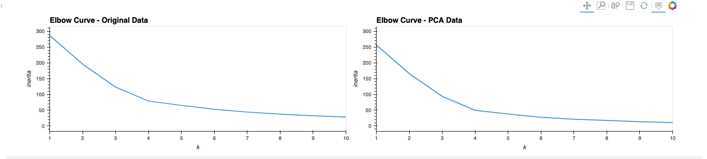
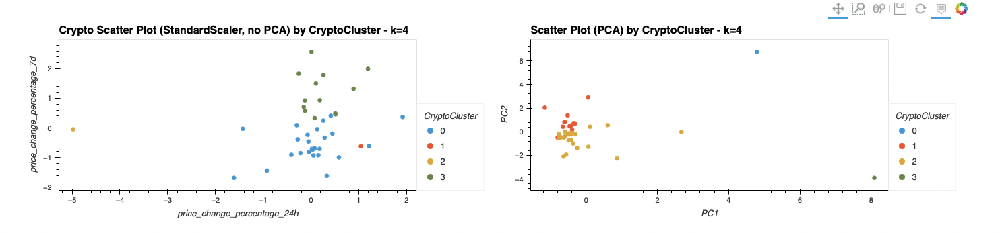

# Crypto Portfolio Clustering
Crypto Portfolio Clustering with and without optimization techniques (elbow method, PCA).  

---

## Analysis 

This is an anlysis of crypto market data, specifically the price-change data, for several crypto tokens. Two different KMeans unsupervised learning approaches were used to analyze this data, and come up with two different cluster plots. The first approach uses the original data, with standard scaling, and the second approach uses PCA - Principal Component Analysis to first reduce the features and then generate a model. In both cases, the Elbow Method was used to choos a k value for the number of clusters.

See full analysis details in the notebook [crypto_investments.ipynb](app/crypto_investments.ipynb)  


#### DataSet  

A single dataset was used to anlyze this space:
- [crypto_market_data.csv](data/crypto_market_data.csv) for price-change data over various time-periods
    - contains data: `coin_id | price_change_percentage_24h | price_change_percentage_7d | price_change_percentage_14d | price_change_percentage_30d | price_change_percentage_60d | price_change_percentage_200d | price_change_percentage_1y`  


#### Assumptions
- Two KMeans algorithm analyses will occur, one with original feature data, one with PCA optimized data.
- Original: will use `price_change_percentage_24h` and `price_change_percentage_7d` for the cluster plot.
- PCA analysis will reduce to 3 components `n_components = 3`
- Each analysis will use the Elbow Method to arrive at the k-value for the KMeans algorithm


## Summary

**Original Feature Data**  
TBD  

**PCA Data**  
TBD   


**General Summary**  


Below are screen caps showing the comparison for the Elbow Methods and resulting cluster plots when using the original standard-scaled vs PCA optimizations.  

  
  


See full analysis implementation, interactive charts, and maps in the notebook [crypto_investments.ipynb](app/crypto_investments.ipynb)  

---

## Technologies

This challenge uses [python](https://www.python.org/) 3.7 and the following [built-in](https://docs.python.org/3/py-modindex.html) modules:
- [os](https://docs.python.org/3/library/os.html#module-os)

Additionally, it requires:
- [matplotlib](https://matplotlib.org/)
- [pandas](https://pandas.pydata.org/)
- [JupyterLab](https://jupyterlab.readthedocs.io/en/stable/)
- [hvplot](https://hvplot.holoviz.org/)
- [scikit-learn](https://scikit-learn.org/stable/index.html)


See [installation](#installation) below for specifics.

---

## Installation

You will need Python 3.7, that supports for this application to run. An easy way to install python 3.7 is to download and install [Anaconda](https://www.anaconda.com/products/individual). After installing anaconda, open a terminal/command-prompt, and setup a python 3.7 environment, and then activate it like so:

```
# create an anaconda python 3.7 environment
# name can be any friendly name to refer to your environment, eg 'dev'
conda create --name dev python=3.7 anaconda

# activating the environment
conda activate dev

# use pip to install the above modules, eg:
pip install python-dotenv
...etc...
```


---

## Usage

The analysis is presented within a [JupyterLab](https://jupyterlab.readthedocs.io/en/stable/) notebook. To launch JupyterLab, from the root of this repo dirctory:

```
# within repo root 
$ jupyter lab
```
You can now open the notebook [crypto_investments.ipynb](app/crypto_investments.ipynb)  

---

## Contributors

[David Lopez](https://github.com/sububer)

---

## License

MIT